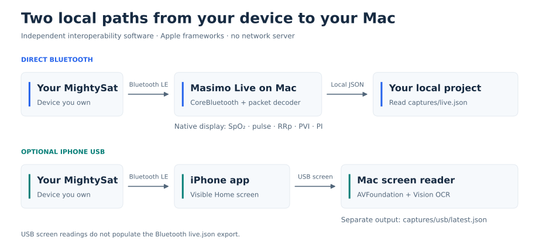
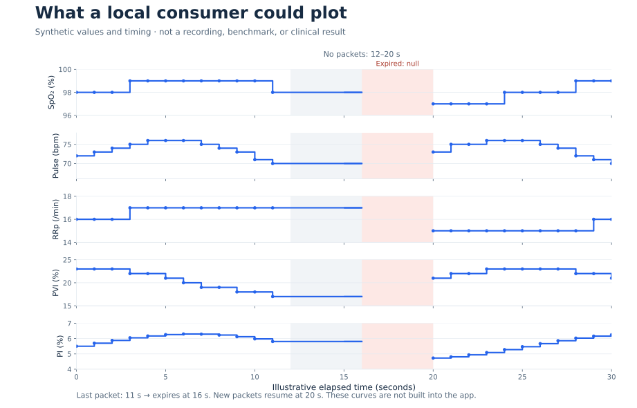
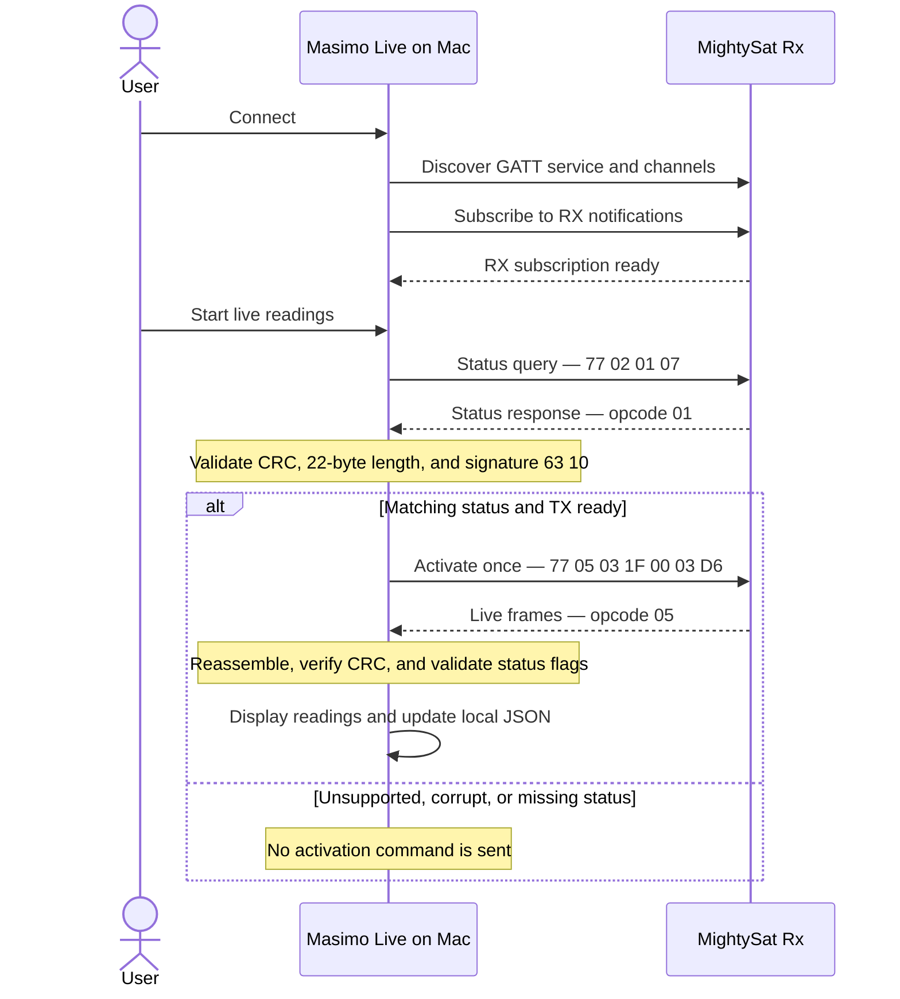
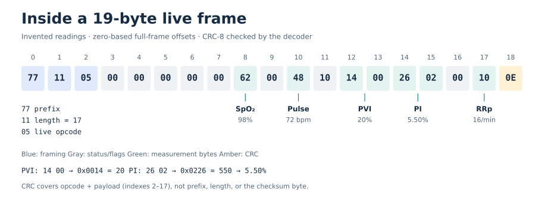
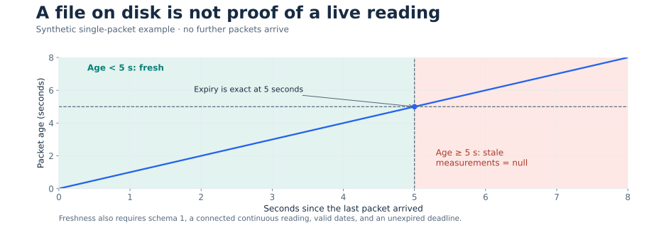

# Masimo Live for macOS

**An independent macOS app for reading a Masimo MightySat over Bluetooth — locally, on your own Mac.**

Built by [Maurice Lichtenberg](https://github.com/LichtenbergM).

I built this because I wanted to connect my own MightySat Rx directly to my Mac and use its readings in local projects. Masimo Live brings those readings into a native SwiftUI app and makes them available as a simple JSON file for other tools.

**This is an independent community project. It is not affiliated with, endorsed by, or supported by Masimo Corporation.** Product names identify the devices this software is intended to work with. See [NOTICE](NOTICE).

> Experimental interoperability software for personal experimentation and software development. It has not been clinically validated or certified for medical use. Do not use it for diagnosis, treatment decisions, alarms, or safety-critical monitoring. Follow the device manufacturer's instructions for the device itself.

## What it does

- Connects directly to a MightySat over Bluetooth Low Energy, without an iPhone in the data path.
- Displays SpO₂, pulse rate, RRp, PVI, and PI when the received packet contains supported, valid values.
- Writes an atomic, local JSON snapshot that other applications can read.
- Provides an optional USB mode that reads the Masimo iPhone app's visible screen using Apple's local text recognition.
- Shows connection diagnostics and records sessions locally for debugging.
- Hides unsupported or invalid measurements and clears stale displayed values after five seconds.

The Mac app uses Apple frameworks only. There are no third-party packages, cloud services, accounts, analytics, or network servers. Python 3 is only needed for the optional JSON client and its tests.



## Example plots

These plots illustrate how another project could consume the local export. **All plotted values and timing are invented.** They are not personal recordings, performance measurements, or evidence of medical accuracy. The current Mac app displays numeric readings; these charts are documentation examples.



In this example, packets arrive once per second until 11 seconds, then resume at 20 seconds. The last reading remains fresh for less than five seconds. At 16 seconds, it expires and becomes `null`. The gaps are produced using the actual `read_live()` client, without reading any sensor recordings. This example cadence is not a claim about a device's sampling rate.

## Compatibility

| Component | Current status |
| --- | --- |
| Mac | macOS 14 or newer; built locally for your Mac's architecture |
| Direct Bluetooth | Tested with one MightySat Rx running firmware **1.0.6.3** |
| Other MightySat models or firmware | Unverified; not a general compatibility guarantee |
| iPhone USB mode | Tested with the observed Masimo app Home screen layout; other layouts are unverified |
| App languages | English and German; selected using macOS language preferences |

Direct streaming is deliberately limited to the observed firmware signature. If a different device connects but does not start streaming, it may be outside the currently supported protocol. Do not bypass that check without validating the protocol first.

The project also includes a decoder for standard Bluetooth Pulse Oximeter characteristics (`2A5E` / `2A5F`) when available. The tested MightySat Rx uses a proprietary service instead.

## Build and run

You need a Mac with Apple's Xcode Command Line Tools and a recent Swift compiler. The project is built in Swift 5 language mode; development builds have been checked with Swift 6.2.3. The deployment target is macOS 14; that does not mean every older compiler has been tested.

Install the Command Line Tools if needed:

```sh
xcode-select --install
```

Then clone and build:

```sh
git clone https://github.com/LichtenbergM/masimo-live.git
cd masimo-live
bash build.sh
open 'Masimo Live.app'
```

The build script creates `Masimo Live.app` in the repository directory and signs it ad hoc for local use. It is not Developer ID signed or notarized. Build from source; no prebuilt application is included in the repository.

Keep the app in a writable directory. Recordings and exports are created in a `captures/` folder **beside the app**, so the paths below assume you leave it in the checkout.

## Connect directly over Bluetooth

1. Close the Masimo app on your phone so it releases the Bluetooth connection.
2. Enable Bluetooth on your MightySat and insert a finger as instructed by the device manufacturer.
3. Open Masimo Live and select **MightySat via Bluetooth**.
4. Allow Bluetooth access if macOS asks. Click **Search for device**.
5. Click **Connect** beside your device.
6. Once the receive channel is ready, click **Start live readings**.

The app first requests device status. After a matching, checksum-valid status response, it sends the observed streaming activation once per connection. It does not automatically reconnect; after reconnecting, click Start live readings again.

Search results are restricted to advertised names containing `MightySat` or `Masimo`, or starting with `MSat`. Unnamed devices and other names are ignored.

Unknown general status combinations suppress the reading. Unsupported supplementary fields are hidden individually. Removing and reinserting a finger was checked on the tested device: invalid readings disappeared and readings resumed when valid packets returned.

### Bluetooth startup, step by step



If CoreBluetooth pauses writes after a matching status response, activation waits for send availability. The same activation is not sent twice within a connection. Other firmware and the activation parameters remain unverified.

### Hex reference: a synthetic live packet



```text
77 11 05 00 00 00 00 00 62 00 48 10 14 00 26 02 00 10 0E
```

This checksum-valid example encodes invented values: **SpO₂ 98%, pulse 72 bpm, RRp 16/min, PVI 20%, PI 5.50%**. Offsets count from zero at the `77` prefix.

| Bytes / offset | Meaning in this example |
| --- | --- |
| `77` / 0 | Frame prefix |
| `11` / 1 | Length: hexadecimal `11` = 17; total size is 17 + 2 = 19 bytes |
| `05` / 2 | Live measurement opcode |
| `62` / 8 | Hexadecimal `62` = decimal 98: SpO₂ |
| `48` / 10 | Hexadecimal `48` = decimal 72: pulse |
| `10` / 11 | Accepted pulse status flag; not a measurement value |
| `14 00` / 12–13 | Little-endian `0x0014` = 20: PVI |
| `26 02` / 14–15 | Little-endian `0x0226` = 550; divide by 100 for PI 5.50% |
| `10` / 17 | Hexadecimal `10` = decimal 16: RRp |
| `0E` / 18 | CRC-8 over indexes 2–17; polynomial `07`, initial value `00` |

The remaining gray bytes are validated status/flag fields, not padding to ignore. Unknown general or pulse status suppresses the reading; unsupported supplementary values disappear individually. See the [full offset and validation notes](docs/PROTOCOL.md).

## Optional: read the iPhone screen over USB

This is a separate way to view readings that are already visible in the iPhone app.

1. Connect the MightySat to the Masimo app on your iPhone.
2. Connect the iPhone to the Mac with a data-capable USB cable, unlock it, and trust the Mac if prompted.
3. Leave the Masimo app's **Home** screen visible with live readings.
4. In Masimo Live, select **iPhone via USB**, choose the iPhone, and click **Read iPhone**.
5. Allow camera access if requested by macOS for the AVFoundation capture path.

The app uses CoreMediaIO / AVFoundation for the USB screen feed and Vision for on-device text recognition. SpO₂ and pulse must be unambiguous; optional values can appear separately. It does not save screenshots or record audio, and it filters screen sources rather than selecting ordinary webcams.

USB mode depends on the visible app layout and a working iPhone-to-MightySat connection. Its timestamps describe screen analysis, not sensor measurement time. The Bluetooth reader disconnects when you select USB mode.

## Interface language

Version 0.4.3 supports English and German throughout the interface, connection messages, errors, and permission prompts. The app follows your macOS language preference, with English as the fallback for unsupported languages.

To choose a language just for Masimo Live, open **System Settings → General → Language & Region → Applications**, add or select Masimo Live, and choose English or German. Quit and reopen the app after changing the language. See [Apple's app language instructions](https://support.apple.com/en-gb/guide/mac-help/-mh26684/mac).

This translates the Mac interface. USB text recognition still expects the previously supported iPhone Home screen layout.

## Use the readings in another project

The **Bluetooth** reader writes `captures/live.json`. USB readings are stored separately in `captures/usb/latest.json` and do not populate this live-export schema.

The snapshot is updated on live frames and once per second. Unavailable values are `null`. This illustrative snapshot uses invented values and timestamps:

```json
{
  "schema_version": 1,
  "source": "bluetooth",
  "connected": true,
  "fresh": true,
  "received_at": "2030-01-01T12:00:00.000Z",
  "valid_until": "2030-01-01T12:00:05.000Z",
  "measurements": {
    "spo2_percent": 98,
    "pulse_bpm": 72,
    "rrp_per_min": 16,
    "pvi_percent": 20,
    "pi_percent": 5.5
  }
}
```

**Always check expiry yourself.** The last file remains on disk after the app quits. `connected` and `fresh` describe the snapshot when it was written; consumers must also check their current time against `valid_until`. `received_at` is the time a packet arrived at the Mac, not a validated sensor timestamp.



The green interval is fresh only while all other validity conditions hold. At the five-second boundary, the client returns `fresh: false` and clears every measurement to `null`. The file's presence or modification time is not enough to establish freshness.

The optional standard-library Python client performs those freshness checks and replaces expired measurements with `null`:

```sh
# Emit changes, including the transition to expired readings:
python3 tools/live_client.py

# Read a single snapshot:
python3 tools/live_client.py --once
```

Run it after the Mac app has created the export. From a Python project, you can import the helper:

```python
import sys
from pathlib import Path

checkout = Path("/path/to/masimo-live")
sys.path.insert(0, str(checkout / "tools"))
from live_client import read_live

snapshot = read_live(checkout / "captures" / "live.json")
if snapshot["fresh"]:
    pulse_bpm = snapshot["measurements"]["pulse_bpm"]
```

The client defaults to `captures/live.json` relative to its own checkout. If you move the app, pass the new export path to `read_live()`. For time-based comparisons, deduplicate using `received_at` and account for unknown device averaging and transmission delay. There is no built-in HTTP API.

## Local data and privacy

| Path, relative to the app's directory | Contents |
| --- | --- |
| `captures/session-*.jsonl` | Bluetooth events, raw packets, device information, and measurements |
| `captures/latest.json` | Current Bluetooth session status |
| `captures/live.json` | Bluetooth measurement snapshot, without serial numbers or raw packets |
| `captures/usb/session-*.jsonl` | Recognized values and limited OCR layout diagnostics |
| `captures/usb/latest.json` | Latest recognized screen values or USB status |

Recordings can contain health data, serial numbers, Bluetooth identifiers, device names, timestamps, and local file paths. The app stores these on your Mac; it does not upload them. New recording directories use permissions `0700` and recording files use `0600`.

`captures/`, app bundles, build output, packet captures, and private development notes are excluded from Git. **Do not attach raw recordings to a public issue.** Share a minimal, redacted example instead. **Clear display** resets visible diagnostics; it does not delete recordings. To delete recordings, stop the app and remove the relevant local files yourself.

## Troubleshooting

| Symptom | What to check |
| --- | --- |
| Device not found | Bluetooth is enabled on both devices, the phone app is closed, and the advertised name matches the filter. Search lasts 30 seconds. |
| Bluetooth permission denied | System Settings → Privacy & Security → Bluetooth → allow Masimo Live. |
| Connected, but no readings | Wait for channel discovery, then click Start live readings. Check the tested firmware requirement and the device's own display. |
| Live readings stop | Check finger placement, unknown status flags, and connection state. Stale values disappear after five seconds. Reconnect manually if necessary. |
| Some optional values are blank | The value is unavailable or its status flag is unsupported. RRp flags `01` and `04` are intentionally hidden. |
| No USB screen source | Use a data cable, unlock and trust the iPhone, and close competing capture apps such as QuickTime. |
| USB readings are blank | Keep the supported Home layout visible with clearly readable SpO₂ and pulse. |
| Export cannot be written | Leave the app in a directory you can write to; inspect the error in the app. |
| `live_client.py` cannot find the file | Start the Mac app first and verify that its `captures/` folder is beside the app in this checkout. |

The USB compatibility fallback currently emits an AVFoundation deprecation warning during compilation. It is retained for older iPhone screen drivers; it does not prevent the build.

## Development

```sh
bash test.sh
bash build.sh
bash Tests/check-localization.sh
```

Tests cover standard and proprietary packet parsing, fragment reassembly, checksums, conservative status handling, streaming session sequencing, OCR parsing, export expiry, and English/German translations. They run without a connected sensor. Python 3 is required for the client tests. GitHub Actions also builds the app and checks its packaged languages, fallback language, deployment target, and signature.

| File | Responsibility |
| --- | --- |
| `Sources/App.swift` | SwiftUI interface, CoreBluetooth connection, and session handling |
| `Sources/Protocol.swift` | Packet framing, decoders, and streaming activation state |
| `Sources/USBReader.swift` | USB screen capture and local OCR |
| `Sources/ScreenReading.swift` | Mapping recognized screen text to readings |
| `Sources/Capture.swift` | Local session recordings |
| `Sources/LiveExport.swift` | Bluetooth JSON snapshot and freshness rules |
| `Sources/Localization.swift`, `Resources/` | Native English/German text and permission prompts |
| `tools/live_client.py` | Optional Python snapshot consumer |

See [protocol notes](docs/PROTOCOL.md) for the implemented wire format, and [CONTRIBUTING.md](CONTRIBUTING.md) before submitting a change or compatibility report.

The figures are available as SVG and PNG. See [visual sources and regeneration](docs/VISUALS.md) to reproduce them; plotting dependencies are separate from the app's build and runtime.

## License and attribution

Copyright © 2026 Maurice Lichtenberg. The project's source code is available under the [MIT License](LICENSE).

If you use Masimo Live in your project, please mention it in your README, credits, or About page. For example: **“Uses [Masimo Live](https://github.com/LichtenbergM/masimo-live) by Maurice Lichtenberg.”** I'd also love to hear what you build with it.

Public credit is appreciated, but optional under MIT. When redistributing the code or substantial portions of it, you must retain the copyright notice and MIT license text as required by [LICENSE](LICENSE).

The license covers this project's code. It does not grant rights to third-party trademarks, software, firmware, or patents. Masimo, MightySat, and other product names remain the property of their respective owners; their use here identifies compatibility. See [NOTICE](NOTICE).
